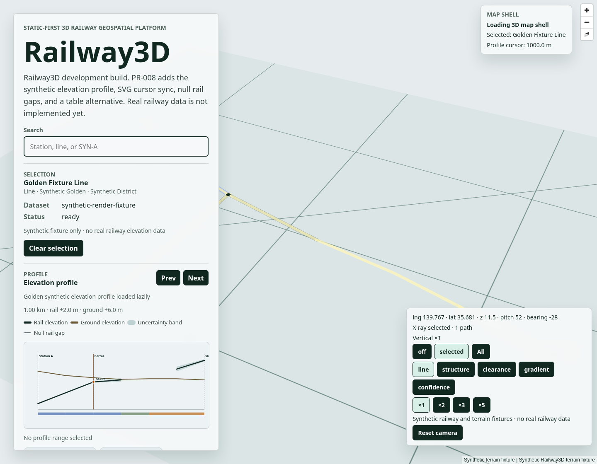

# Railway3D

Static-first 3D railway geospatial platform.

[Live development build](https://rsasaki0109.github.io/Railway3D/)



## Status

This repository is in early bootstrap. The current site is a development build
that verifies the workspace, static deployment path, test setup, schema/domain
foundation, data-client skeleton, MapLibre/deck.gl map shell, and synthetic
railway rendering/search/selection layers, visualization modes, dynamic legend,
layer controls, and the synthetic SVG elevation profile. It does not render real
railway data yet.

Implemented milestones:

- PR-001: pnpm monorepo, Vite/React app shell, GitHub Pages workflow, Vitest,
  Playwright smoke test, and Python CLI skeleton.
- PR-002: JSON Schema v1 draft, generated TypeScript types, domain pure
  functions, stable ID validation, Python schema validation adapter, and
  synthetic golden fixture.
- PR-003: static data client with catalog/manifest loading, schema validation,
  schema compatibility checks, asset URL safety, host allowlist, abort support,
  retry policy, typed errors, cache, and checksum validation.
- PR-004: MapLibre and deck.gl shell, same-origin synthetic terrain fixture,
  attribution, WebGL2 capability check, context loss state, resize handling, and
  reduced-motion camera reset behavior.
- PR-005: synthetic railway render dataset, physical rail layer, X-ray halo/core
  layers, station layers, selection/profile guide layers, vertical
  exaggeration, and layer factory tests.
- PR-006: app state store, share URL parser/serializer, synthetic search index,
  keyboard search command, line/station selection, inspector skeleton, and
  browser back/forward restoration.
- PR-007: five visualization modes, style resolver tests, dynamic legend,
  uncertainty cue layer, vertical/X-ray state badges, and layer visibility
  controls.
- PR-008: SVG elevation profile panel, lazy synthetic profile loading,
  profile-to-map cursor sync, brush fit, null rail gaps, keyboard sample
  stepping, and a table alternative.

## Local Development

Requirements:

- Node.js `>=24 <25`
- pnpm `11.x`
- Python `3.12+`
- uv

```bash
pnpm install --frozen-lockfile
pnpm dev
```

Open `http://localhost:5173/`.

## Validation

```bash
pnpm format:check
pnpm lint
pnpm typecheck
pnpm test
pnpm build
uv sync --project tools/pipeline --frozen
uv run --project tools/pipeline pytest
pnpm test:e2e
```

## Scope Guard

Railway3D is static-first. The MVP does not include Cesium, three.js,
react-three-fiber, a backend, authentication, realtime APIs, or runtime-required
secret keys. Unknown railway elevation data remains unknown; synthetic fixtures
are kept separate from real-world datasets.

## License

Code license is not finalized in this bootstrap commit. Data and third-party
source licenses will be tracked separately from code before public dataset
release.
